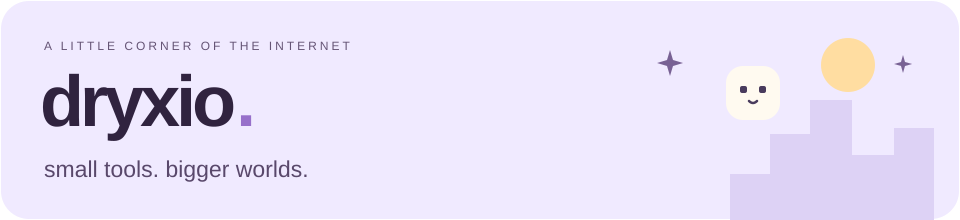

I build AI tools for reverse engineering and making new things with classic GTA games.

<a href="#worlds--playgrounds">Worlds &amp; playgrounds</a> &nbsp;·&nbsp; <a href="#under-the-hood">Under the hood</a> &nbsp;·&nbsp; <a href="#little-tools--experiments">Little tools</a>

## Worlds & playgrounds

<table>
<tr>
<td width="50%" valign="top" align="center">
<h3><a href="https://github.com/Dryxio/ariane">ariane</a></h3>

A modern map editor for GTA III, Vice City and San Andreas.

</td>
<td width="50%" valign="top" align="center">
<h3><a href="https://github.com/Dryxio/gta-3d-ai">gta-3d-ai</a></h3>

Find GTA assets. Build with AI and Blender. Early alpha · preview from the wider Blender workflow.

</td>
</tr>
<tr>
<td width="50%" valign="top" align="center">
<h3><a href="https://github.com/Dryxio/mtasa-neon">mtasa-neon</a></h3>

Larger worlds, native NPCs and traffic, new rendering and Lua possibilities. Experimental MTA:SA engine fork.

</td>
<td width="50%" valign="top" align="center">
<h3><a href="https://github.com/Dryxio/gta-sa-traffic">gta-sa-traffic</a></h3>

Author road networks with AI and Blender. Compile native San Andreas traffic nodes. Early alpha.

</td>
</tr>
</table>

 

## Under the hood

<table>
<tr>
<td width="50%" valign="top" align="center">
<h3><a href="https://github.com/Dryxio/auto-re-agent">auto-re-agent</a></h3>

AI agents that reconstruct and validate C/C++ from binaries. Powered by Ghidra.

</td>
<td width="50%" valign="top" align="center">
<h3><a href="https://github.com/Dryxio/ghidra-ai-bridge">ghidra-ai-bridge</a></h3>

Let AI agents explore decompiled code, types and cross-references through a CLI and Python API.

</td>
</tr>
<tr>
<td width="50%" valign="top" align="center">
<h3><a href="https://github.com/Dryxio/samp-source">samp-source</a></h3>

Rebuilding SA-MP R5, one verified binary match at a time.

</td>
<td width="50%" valign="top" align="center">
<h3><a href="https://github.com/Dryxio/plugin-sdk-sa">plugin-sdk-sa</a></h3>

A San Andreas-focused Plugin-SDK fork, expanded with reverse-engineering findings.

</td>
</tr>
</table>

 

## Little tools & experiments

<table>
<tr>
<td width="50%" valign="top" align="center">
<h3><a href="https://github.com/Dryxio/DockDrop">DockDrop</a></h3>

A little floating shelf that makes dragging files between Mac apps easier.

</td>
<td width="50%" valign="top" align="center">
<h3><a href="https://github.com/Dryxio/tamago-life">kodama</a></h3>

A grove of pixel-art spirits for keeping an eye on your Claude Code agents.

</td>
</tr>
<tr>
<td width="50%" valign="top" align="center">
<h3><a href="https://github.com/Dryxio/cleo-ai">cleo-ai</a></h3>

Make GTA SA scripts with AI, backed by opcode references and compiler checks.

</td>
<td width="50%" valign="top" align="center">
<h3><a href="https://github.com/Dryxio/wiki.mtasa-neon.com">Neon wiki</a></h3>

The documentation home for Neon, built on the MTA wiki.

</td>
</tr>
<tr>
<td width="50%" valign="top" align="center">
<h3><a href="https://github.com/Dryxio/openclaw-lullabully">openclaw-lullabully</a></h3>

Bedtime reminders that get increasingly insistent until you go to sleep.

</td>
<td width="50%" valign="top" align="center">
<h3><a href="https://github.com/Dryxio/samp-r5-rebuild">samp-r5-rebuild</a></h3>

An early experiment in rebuilding a functional SA-MP R5 client DLL.

</td>
</tr>
</table>

 

<strong>On the side · forks</strong>

<a href="https://github.com/Dryxio/mtasa-blue"><strong>mtasa-blue</strong></a> 

<a href="https://github.com/Dryxio/gta-reversed"><strong>gta-reversed</strong></a> 

<a href="https://github.com/Dryxio/skygfx"><strong>skygfx</strong></a> 

<a href="https://github.com/Dryxio/GTA-GPS-Redux"><strong>GTA-GPS-Redux</strong></a> 

<a href="https://github.com/Dryxio/Radar-in-style-GTA-SA-The-Definitive-Edition"><strong>Definitive Edition radar</strong></a> 

<a href="https://github.com/Dryxio/library"><strong>library</strong></a> 

<a href="https://github.com/Dryxio/fastman92_limit_adjuster"><strong>fastman92_limit_adjuster</strong></a> 

 <a href="https://github.com/Dryxio?tab=repositories">Explore all repositories ↗</a>

